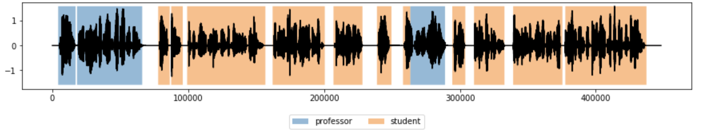

# Speaker Diarization using GRU in PyTorch
## Installation
### Conda environment
To use this conda environment, you need to install [Miniconda](https://docs.conda.io/en/latest/miniconda.html), then run this command

`conda env create -f environment.yml`

### Install OpenVINO (Optional)
If you would like to use OpenVINO for inference. Please check [OpenVINO official Documentation](https://docs.openvinotoolkit.org/latest/_docs_install_guides_installing_openvino_linux.html) for the installation.

## Step 1: Training :muscle:
Simply run the code in the `Part 1 - Training.ipynb` notebook and you are good to go.

Here is the training process if you would want to learn more:
- Dataset Preparation <br>
    You should structure your data in these format:
    ```
    data
        train
            speaker_1
                audio_1.wav
                audio_2.wav
            speaker_2
                audio_1.wav
                audio_2.wav            
        valid
            speaker_1
                audio_1.wav
                audio_2.wav
            speaker_2
                audio_1.wav
                audio_2.wav
        test
            both_speaker_speaking.wav      
    ```


    You can use this [sample dataset in Kaggle](https://www.kaggle.com/wiradkp/mini-speech-diarization) to help you understand how to structure your own data.

- Dataset & Dataloader <br>
    I have created `AudioFolder` PyTorch Dataset Object so automatically utilize the dataset. Here is a quick look for you
    ```
    AudioFolder(folder_path, n_data=500, slice_dur=5, sr=16000, n_mel=128, n_fft=2048, win_length=2048, hop_length=1024, freq_range=(0, 8000)):
    ```
    In a nutshell, here is what it does:
    - Randomly choose an audio from `folder_path`, then sampled it using `sr` rate
    - Then it randomly slice a chunk of the audio for `slice_dur` seconds, quantile normalize, then converted to log melspectrogram using specified parameter (`n_mel`, `n_fft`, and so on)
    - Zero crossing rate is used as VAD to label the spectrogram frames. Each frame is labeled as the subfolder name or `<NONE>` if it is silent.
    - `AudioFolder` does these steps `n_data` times to create the dataset

- Architecture & Config <br>
    Simply create the model architecture you would like to use. I have made one sample for you in `src/model.py`. You can directly use it by simple changing the hyperparameters in the config. Please follow the notebook if you are confused.

    :exclamation: Note: If you would like to use custom architecture in OpenVINO, make sure it is compatible with OpenVINO model optimizer and inference engine.

- Training Preparation <br>
    Set up the `model`, `criterion`, `optimizer`, and `callback` here.

- Training <br>
    As what it says, running the code will train the model

## Step 2: Inference :robot:
I have prepared a `PyTorchPredictor` and `OpenVINOPredictor` object. Here is a sneak peek:
```
PyTorchPredictor(weights_path, config_path, chunk_dur)
OpenVINOPredictor(model_xml, model_bin, config_path, chunk_dur, CPU_EXT)
```
To use it, simply input the arguments and use `.predict(wav_path)` and it will return the diarization timestamp. For example:
```
p = PyTorchPredictor("model/weights_best.pth", "model/configs.pth", chunk_dur=2)
timestamp = p.predict("dataset/test/test.wav", plot=True)
```
setting `plot=True` provides you with the diarization visualization like this


If you would like to use OpenVINO, use `.to_onnx(fname, outdir)` to convert the model into onnx format.
```
p.to_onnx("speaker_diarization.onnx", "model")
```

## End notes :heart:
I hope you like the projects. I made this repo for educational  purposes so it might need further tweaking to reach production level. Feel free to create an issue if you need help, and I hope I'll have the time to help you. Thank you.